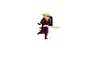
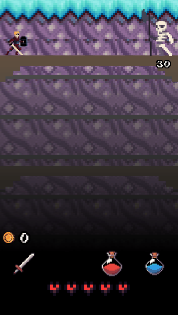

# Project-Descent
Visit the realm of Arradalar to save the towns from their overrun dungeons. As more and more creatures have invaded the dungeons, adventurers have become scarce, leaving the villages across the realm without their protectors. Save the villages and have your name in the history book for age by annihilating the monsters in these villages and be rewarded with the cheers of the people and the booze of the inns.

## Characters:
 

## Monsters:
 

 

 

## Merchant:

## Fight Demo:

### About
Created a Mobile RPG game using the godot engine with gdscript which is based on python and then photoshop to create/alter the assets for the project
